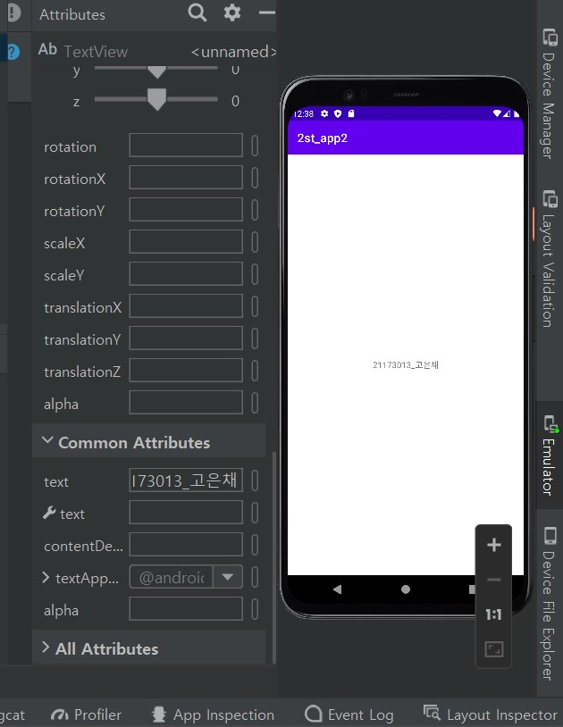
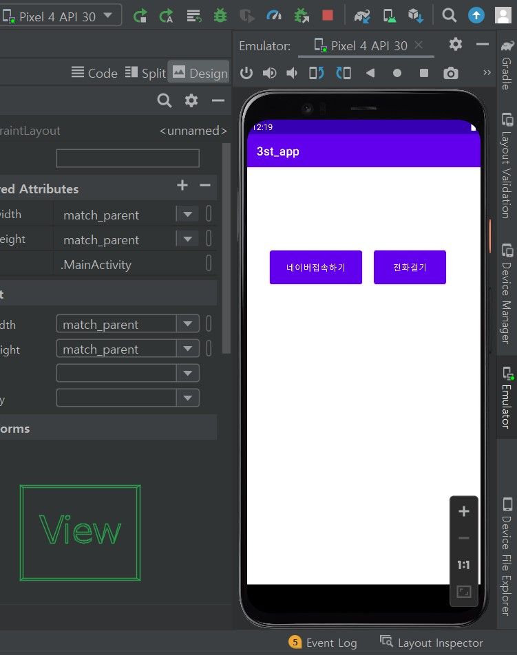
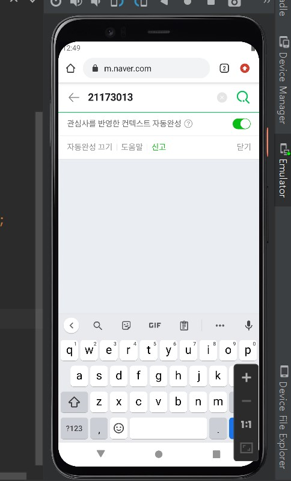
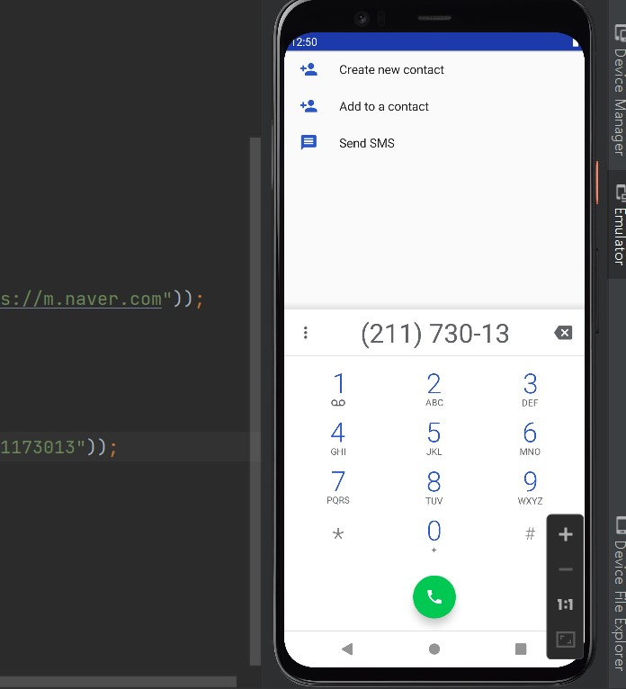
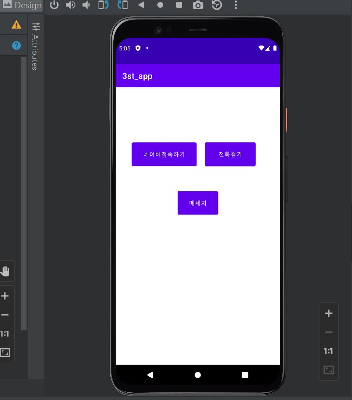
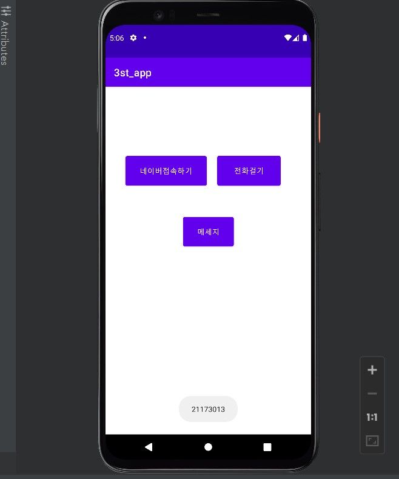
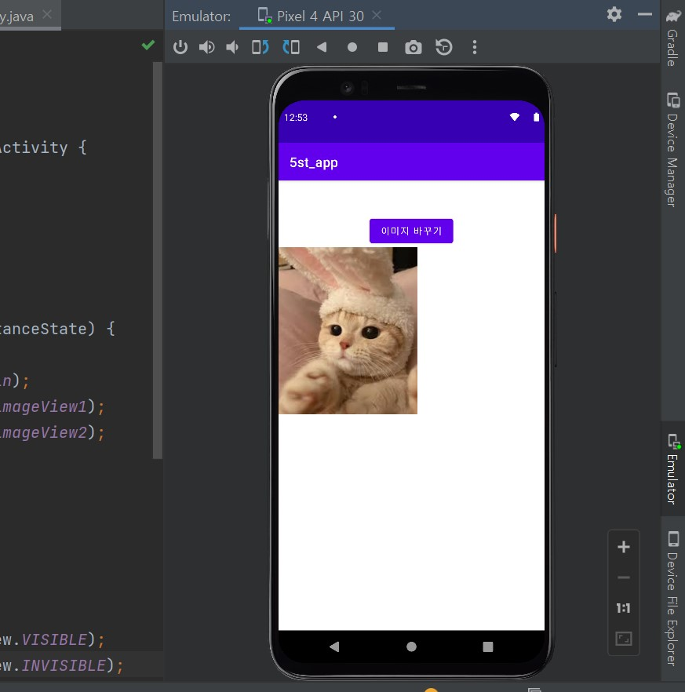
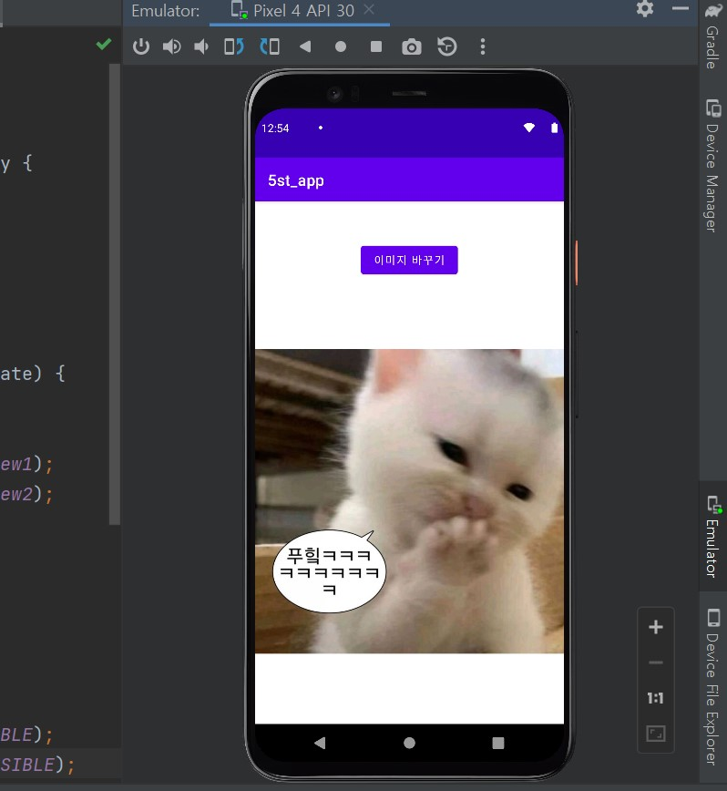

# 플랫폼 비즈니스 ♥
## 2주차 (2022-03-15)
- 안드로이드스튜디오 설치 & 깃허브 가입 및 레포지토리 만듬

</img>

## 3주차 (2022-03-22)
-안드로이드스튜디오 버튼 생성 & 시뮬레이션 돌리기

</img>

</img>

</img>

## 4주차 (2022-03-29)
-안드로이드스튜디오 버튼으로 메세지 띄우기 & 코드로 디자인해보기 & 픽셀과 dpi 이론

</img>

</img>

## 5주차 (2022-04-05)
-안드로이드스튜디오 버튼으로 사진 전환하기 / 리니어 레이아웃 (쌓으면서 생성) / 프레임 레이아웃 (버튼을 이용하여 각 뷰를 전환)

</img>

</img>
